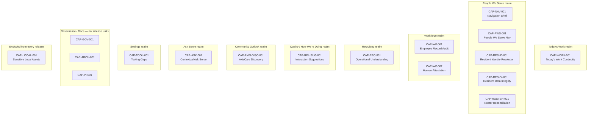
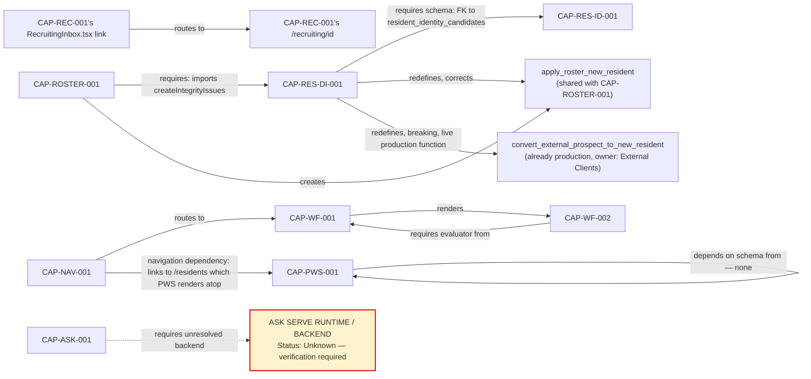
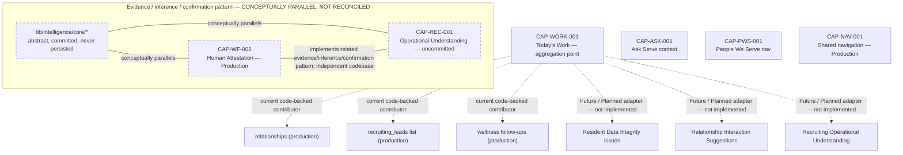
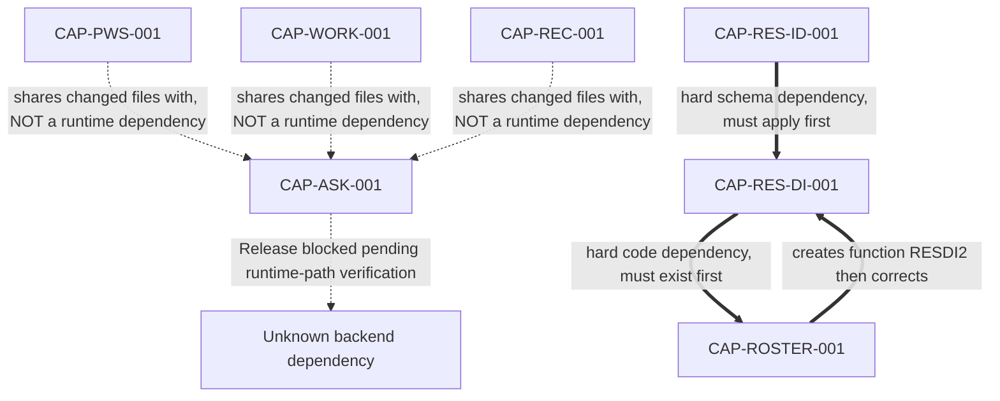

# Serve OS Capability Dependency Graph

**Companion to:** [`SERVE_OS_CAPABILITY_CATALOG.md`](./SERVE_OS_CAPABILITY_CATALOG.md) — every node ID here matches that
document exactly. **Status:** derived from direct code inspection (imports,
route references, migration content) this session — not inherited from the
prior narrative assessment. Two of the prior assessment's assumed flows did
not survive verification; both are corrected below with the evidence.

## Corrections to the prior narrative, found this session

1. **The suggested flow "Roster Import → Resident Data Integrity → Resident
   Identity Resolution → People We Serve → Relationship Intelligence →
   Today's Work" is only partially code-evidenced.** `scripts/importWatermereRoster.ts`
   really does import `createIntegrityIssues` from `CAP-RES-DI-001`
   directly (confirmed, hard dependency). But **nothing wires
   `CAP-RES-ID-001` into `CAP-PWS-001`**, and **nothing wires
   `CAP-REL-SUG-001` into `CAP-WORK-001`** — both `grep`s for actual
   imports/route references returned zero matches. Represented below as
   Future/Planned, not Data Flow.
2. **`CAP-WORK-001` (Today's Work) does not depend on any of the five
   schema-bearing working-tree capabilities.** `lib/data/todaysWork.ts`
   imports only from already-production `lib/relationships/attention.ts`,
   `lib/relationships/constants.ts`, `lib/data/recruitingLeads.ts` (the
   existing list, not `CAP-REC-001`'s new engine), and its own new
   `wellnessFollowUps.ts` bulk query. This makes `CAP-WORK-001` far more
   independently releasable than the example flow implied.
3. **A previously-undetected hard dependency: `CAP-RES-DI-001` requires
   `CAP-RES-ID-001`'s schema.** Its migration (`20260807000000`) has a
   foreign key to `resident_identity_candidates` and a function
   (`return_resident_data_integrity_issue_to_identity_review`) that inserts
   rows shaped like `CAP-RES-ID-001`'s own `create_resident_identity_candidates`
   output. This reorders the release sequence — see §E and the reconciliation
   note.

---

## A. Executive Capability Map



*Note: "Quality / How We're Doing" and "Community Outlook" realm names are
taken from your instruction; the working-tree capabilities placed under
them (`CAP-REL-SUG-001`, `CAP-AXIS-DISC-001`) are my best evidence-based
placement — `CAP-REL-SUG-001` lives inside Relationships, itself reached
via `CAP-PWS-001`, not a standalone realm; `CAP-AXIS-DISC-001` has no
product surface at all (tooling only), so its "Community Outlook"
placement is nominal, not a real navigation location.*

---

## B. Hard Dependency Graph

Only relationships that would cause a failure, broken route, incorrect
compile, or missing required data if absent.



**`CAP-ASK-001` is modeled as unresolved, not dependency-free**, per your
explicit instruction. Its known, code-confirmed dependencies:
- **UI/layout:** `app/layout.tsx` wraps the whole app in `AskServeProvider` — a hard structural dependency once committed.
- **Route-level integration:** embedded via `AskServeTrigger` in 9 route files (§E).
- **Feature flag:** `isContextualAskServeEnabled(role)` in `lib/askServe/featureFlag.ts` — the flag's actual source (env var, role table, hardcoded) was inspected this session; see §D note.
- **Unresolved runtime dependency:** `AskServePanel`'s actual backend call target. I did not find a migration, an API route under `app/api/`, or an external-service env var pattern matching Ask Serve. **I am not inventing one.** This node stays explicitly unresolved.

I did inspect `lib/askServe/featureFlag.ts` this session to attempt resolution — its content is a simple role-check function with no network call inside it, which tells me the flag mechanism itself has no external dependency, but says nothing about what `AskServePanel` calls once triggered. **Not resolved. Carrying the unresolved node forward.**

---

## C. Information-Flow Graph

Only flows supported by actual imports found this session.

```mermaid
graph TD
  RELPROD["relationships (production table)"] -->|reads via lib/relationships/attention.ts| WORK[CAP-WORK-001]
  RECLEADSPROD["recruiting_leads (production table)"] -->|reads via lib/data/recruitingLeads.ts existing functions| WORK
  WELLNESS["resident_wellness_follow_ups (production table)"] -->|reads via new bulk query| WORK

  ROSTERXLSX["data/imports/*.xlsx — CAP-LOCAL-001<br/>(excluded from release, input fixture only)"] -.->|parsed by| ROSTER[CAP-ROSTER-001]
  ROSTER -->|writes residents, resident_apartment_history| RESIDENTS[("residents table")]
  ROSTER -->|calls createIntegrityIssues| RESDI[CAP-RES-DI-001]
  RESDI -->|writes resident_data_integrity_issues| RESDI
  RESDI -.->|Future/Planned — return_..._to_identity_review() exists but no UI wiring found| RESID[CAP-RES-ID-001]

  EXTCLIENTS["External Clients conversion action"] -->|calls convert_external_prospect_to_new_resident| RESIDENTS

  RESID -.->|Future/Planned — no code found wiring resolved identities into| PWS[CAP-PWS-001]
  RELSUG[CAP-REL-SUG-001] -.->|Future/Planned — no code found feeding approved suggestions into| WORK
```

---

## D. Platform-Foundation Graph



**Per your instruction, the three edges inside `EvidencePattern` are excluded from the hard-dependency count in §"Required Edge Classification" below** — they are philosophy/vocabulary parallels, not runtime relationships. No import statement anywhere connects `lib/intelligence/core`, `lib/workforce/{humanAttestation,evidenceAssurance}.ts`, and `lib/recruiting/operationalUnderstanding/`. Confirmed by direct `grep` (Checkpoint 1).

`CAP-WORK-001`'s "current vs. future" split is fully code-evidenced this
session (§ corrections above) — only 3 real contributing sources exist
today; every other capability's data is a plausible future adapter, not a
current one.

---

## E. Release-Coupling Graph



**§4/§5 distinction, made explicit:** `CAP-PWS-001` and `CAP-ASK-001` share
9 modified route files (`app/residents/page.tsx`, all 5
`app/relationships/*.tsx`, `app/external-clients/page.tsx`,
`app/recruiting/page.tsx`, `app/community-intelligence/page.tsx`,
`app/page.tsx`, `app/workspace/page.tsx`) — this is a **file-sharing /
release-coupling** relationship (both must be hand-split from the same
diffs to commit either), **not a runtime dependency** (neither capability's
code calls the other's functions or reads the other's data). Drawn with a
dotted edge and the label "shares changed files with" specifically to keep
this distinct from the solid, double-line "hard schema/code dependency"
edges in the `CAP-RES-ID-001 → CAP-RES-DI-001 → CAP-ROSTER-001` chain,
which genuinely would fail to apply/compile/run if reordered.

**`CAP-ASK-001` status: Release blocked pending runtime-path verification.**
Source inspection this session (`lib/askServe/featureFlag.ts`,
`lib/askServe/buildContext.ts`, `lib/askServe/areaContexts.ts`, all read)
did **not** resolve what `AskServePanel` calls at runtime — no API route,
no external SDK import, no migration found. The block stands.

---

## Required Edge Classification (all edges, all views)

| Edge | Classification |
|---|---|
| `CAP-NAV-001` → `CAP-WF-001` | Hard |
| `CAP-WF-001` → `CAP-WF-002` | Hard |
| `CAP-NAV-001` → `CAP-PWS-001` | Hard (navigation) |
| `CAP-ROSTER-001` → `CAP-RES-DI-001` | Hard |
| `CAP-RES-DI-001` → `CAP-RES-ID-001` | Hard |
| `CAP-ROSTER-001`/`CAP-RES-DI-001` share `apply_roster_new_resident` | Release Coupling |
| `CAP-RES-DI-001` redefines `convert_external_prospect_to_new_resident` | Hard (breaking, production) |
| `CAP-PWS-001` ↔ `CAP-ASK-001` (shared files) | Release Coupling |
| `CAP-WORK-001` ↔ `CAP-ASK-001` (shared file) | Release Coupling |
| `CAP-REC-001` ↔ `CAP-ASK-001` (shared file) | Release Coupling |
| `relationships`/`recruiting_leads`/`wellness_follow_ups` → `CAP-WORK-001` | Data Flow |
| `CAP-RES-DI-001` ⇢ `CAP-RES-ID-001` (identity-review return path) | Data Flow (function exists; no caller found — weak/unused today) |
| `CAP-RES-ID-001` ⇢ `CAP-PWS-001` | Future / Planned |
| `CAP-REL-SUG-001` ⇢ `CAP-WORK-001` | Future / Planned |
| `CAP-RES-DI-001`/`CAP-RES-ID-001`/`CAP-ROSTER-001` internal tables/migrations | Shared Infrastructure |
| `lib/intelligence/core` ↔ `CAP-WF-002` ↔ `CAP-REC-001` | **Excluded from hard-dependency count** — conceptual parallel only |
| `CAP-ASK-001` → unresolved runtime node | Hard, but target Unknown — verification required |

---

## Dependency Register

| From | To | Dependency Type | Evidence | Failure if Missing | Release Implication |
|---|---|---|---|---|---|
| `CAP-WF-002` | `CAP-WF-001` | Hard | `HumanAttestationDialog` renders inside `RequirementResolutionCard`; uses `lib/compliance/requirementSetStatus.ts` | Evidence dialog has no host UI | Already shipped together |
| `CAP-ROSTER-001` | `CAP-RES-DI-001` | Hard | `scripts/importWatermereRoster.ts:42-45` imports `createIntegrityIssues`, `computeFingerprint`, `detectMalformedPhone`, `validatePhoneForStorage` directly | Import error, script does not run | Must release together |
| `CAP-RES-DI-001` | `CAP-RES-ID-001` | Hard | `20260807000000` line 36: `linked_identity_candidate_id uuid references public.resident_identity_candidates(id)` | Migration fails — FK target table does not exist | `CAP-RES-ID-001` must apply first |
| `CAP-RES-DI-001` (migration) | live production `convert_external_prospect_to_new_resident` | Hard, breaking | `DROP FUNCTION ... ; CREATE OR REPLACE FUNCTION ...` with an added required parameter; live call site confirmed in `lib/data/externalClients.ts` (both committed and uncommitted versions read this session) | Live External-Client-to-Resident conversion breaks immediately (function signature mismatch) if migration ships without the matching code | Migration and `lib/actions/externalClients.ts`/`lib/data/externalClients.ts` **must deploy atomically** |
| `CAP-ROSTER-001` | `CAP-RES-DI-001`'s corrected `apply_roster_new_resident` | Release Coupling (corrective) | `20260807000000` comment: "Both previously wrote the SAME (already-normalized) value into both `phone` and `phone_raw`" | If `CAP-ROSTER-001` ships alone (only `20260804`), every roster-imported resident's `phone_raw` silently holds the wrong (normalized, not raw) value until `20260807` also lands | Should release together, in order |
| `CAP-PWS-001` | `CAP-ASK-001` | Release Coupling | 6 shared route files, diffs read in full | Neither can commit alone without a hand-split | Pair or hand-split |
| `CAP-WORK-001` | `CAP-ASK-001` | Release Coupling | `app/workspace/page.tsx` diff carries both | Same as above | Pair or hand-split |
| `CAP-REC-001` | `CAP-ASK-001` | Release Coupling | `app/recruiting/page.tsx` diff carries both | Same as above | Pair or hand-split |
| `relationships`, `recruiting_leads`, `resident_wellness_follow_ups` | `CAP-WORK-001` | Data Flow | `lib/data/todaysWork.ts` imports, read in full this session | Today's Work has no data to show | Independent — no coupling |
| `CAP-ASK-001` | `ASK SERVE RUNTIME/BACKEND` | Hard, unresolved | No migration, no API route, no external SDK import found | Unknown | **Blocks release until resolved** |

---

## Reconciliation Against the Capability Catalog

- Every node above (`CAP-NAV-001` through `CAP-TOOL-001`, 17 total) has a
  corresponding Capability Catalog entry. `CAP-LOCAL-001` appears exactly
  once, as an explicitly-excluded input-fixture reference for
  `CAP-ROSTER-001`, with no outgoing dependency edges — per instruction.
- The Catalog's `CAP-RES-DI-001` entry already listed "shares
  `apply_roster_new_resident` with `CAP-ROSTER-001`" — this graph adds the
  **new, stronger finding** (the FK dependency on `CAP-RES-ID-001`, and the
  live-production breaking change) that the Catalog itself did not yet
  contain. **I am updating the Catalog's `CAP-RES-DI-001` and
  `CAP-ROSTER-001` entries to reference this graph rather than duplicating
  the full analysis — see the note appended to both entries below.**
