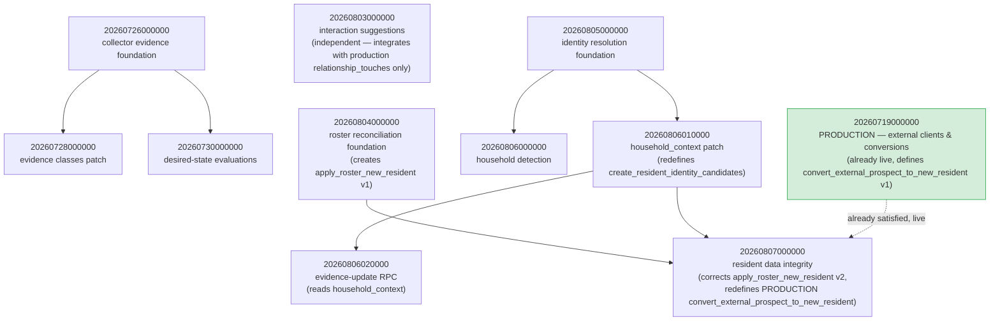
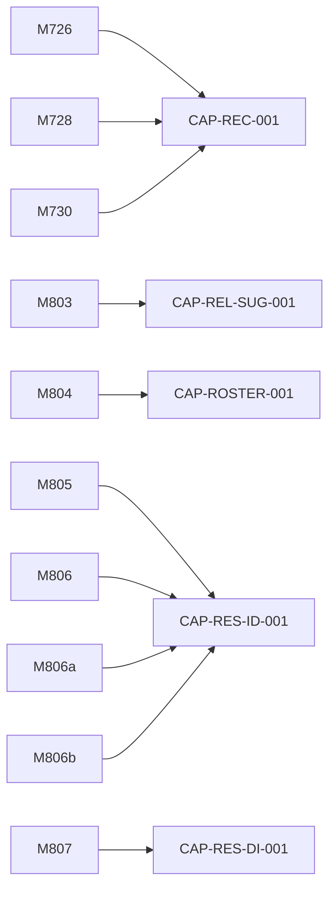

# Serve OS Migration Dependency Graph

**Companion to:** [`SERVE_OS_CAPABILITY_CATALOG.md`](./SERVE_OS_CAPABILITY_CATALOG.md),
[`SERVE_OS_CAPABILITY_DEPENDENCY_GRAPH.md`](./SERVE_OS_CAPABILITY_DEPENDENCY_GRAPH.md),
and [`sql/SERVE_OS_PENDING_MIGRATION_VALIDATION.sql`](./sql/SERVE_OS_PENDING_MIGRATION_VALIDATION.sql).
**No migration was applied, and no database was modified, in the production
of this document** — every claim below is derived from reading the `.sql`
files in `supabase/migrations/` and cross-referencing application code that
calls the functions they define.

## Two findings that change the risk picture materially

1. **`convert_external_prospect_to_new_resident` is not a working-tree-internal
   naming collision — it is an already-live, production function**
   (`20260719000000`, committed on `main`). The pending `20260807000000`
   drops it and recreates it with an added required parameter. This is the
   highest-risk single operation found across all 10 migrations — see M4
   entry below and the Shared-Object Conflict section.
2. **`apply_roster_new_resident`'s replacement is a genuine, well-documented
   bugfix**, not an accidental collision: the original wrote the same
   normalized phone value into both `phone` and `phone_raw`, silently
   defeating the purpose of a separate raw-value column. The fix is
   additive-signature (inserts one new parameter) and behavior-correct.
   Still classified M4 because it changes an existing function's behavior,
   but the *direction* of the change is corrective, not risky, in itself —
   the risk is entirely about **sequencing** (see partial-application states
   below), not about the fix being wrong.

---

## Full Migration Inventory

| Migration | Capability | Creates | Alters Existing | Depends On | Live Status |
|---|---|---|---|---|---|
| `20260726000000_create_recruiting_lead_collector_evidence.sql` | CAP-REC-001 | `recruiting_lead_collector_runs`, `recruiting_lead_observations` | — | none | Unknown |
| `20260728000000_create_recruiting_lead_evidence_classes.sql` | CAP-REC-001 | — | `recruiting_lead_observations` (+9 cols, +4 constraints) | `20260726` | Unknown |
| `20260730000000_create_recruiting_lead_desired_state_evaluations.sql` | CAP-REC-001 | `recruiting_lead_desired_state_evaluations`, `..._evidence` | — | `20260726` (FK) | Unknown |
| `20260803000000_create_relationship_interaction_suggestions.sql` | CAP-REL-SUG-001 | `relationship_interaction_suggestions` | `relationship_touches` (+1 nullable col, **production table**) | none (integrates with production) | Unknown |
| `20260804000000_create_roster_reconciliation.sql` | CAP-ROSTER-001 | `roster_import_runs`, `roster_source_rows`, `resident_apartment_history`, `roster_absence_reviews` | — (creates `apply_roster_new_resident`, later corrected) | none | Unknown |
| `20260805000000_create_resident_identity_resolution.sql` | CAP-RES-ID-001 | `resident_identity_candidates` (+4 tables) | — | none | Unknown |
| `20260806000000_create_resident_household_detection.sql` | CAP-RES-ID-001 | `resident_household_links` | — | `20260805` (FK) | Unknown |
| `20260806010000_add_household_context_to_resident_identity_candidates.sql` | CAP-RES-ID-001 | — | `resident_identity_candidates` (+1 col, +1 constraint); redefines `create_resident_identity_candidates` (additive) | `20260805` | Unknown |
| `20260806020000_add_update_resident_identity_candidate_evidence.sql` | CAP-RES-ID-001 | new function `update_resident_identity_candidate_evidence` (remediation RPC, not auto-invoked) | — | `20260805`, `20260806010000` (reads `household_context`) | Unknown |
| `20260807000000_create_resident_data_integrity.sql` | CAP-RES-DI-001 | `resident_data_integrity_issues` (+2 tables) | redefines `apply_roster_new_resident` (corrective) **and** `convert_external_prospect_to_new_resident` (breaking — production) | `20260804`, `20260805` (FK), production `20260719000000` | Unknown |

**Every "Live Status" cell is `Unknown` — no exception.** I have no Supabase
CLI, `psql`, or database credentials in this environment. Every query
needed to resolve each cell is in the companion SQL file. A passing
`npm run build` proves the TypeScript compiles against the types checked
into `lib/supabase/types.ts` — none of these 10 migrations' objects are
represented there, so the build proves nothing about their live status.

---

## Risk Classification (M1–M5)

| Migration | Risk Class | Basis |
|---|---|---|
| `20260726000000` | **M1** — Additive isolated | Two new tables, indexes, RLS only |
| `20260728000000` | **M3** — Existing schema alteration | Alters `recruiting_lead_observations` (columns + constraints) — "existing" here means an object from an earlier migration in this same pending chain, not production |
| `20260730000000` | **M1** — Additive isolated | Two new tables; FK reference only, no alteration |
| `20260803000000` | **M2** — Additive integrated | New table + one new nullable column on **production** `relationship_touches` + 3 new functions |
| `20260804000000` | **M1** — Additive isolated (at time of its own application) | Four new tables, new functions — nothing existing altered *by this migration itself* |
| `20260805000000` | **M1** — Additive isolated | Five new tables, one new function |
| `20260806000000` | **M1** — Additive isolated | One new table, FK dependency on `20260805`, one new function |
| `20260806010000` | **M4** — Existing function/behavior replacement (confirmed additive) | `ALTER TABLE` + `CREATE OR REPLACE FUNCTION create_resident_identity_candidates` with the **same signature** — full-body diff confirms backward-compatible (old callers' payloads still work; new `householdContext` key is optional) |
| `20260806020000` | **M2** — Additive integrated | One new function, no replacement, integrates with existing (pending-chain) table |
| `20260807000000` | **M4/M5 boundary** — Existing function/behavior replacement, one instance touching **live production data path** | Redefines two functions. `apply_roster_new_resident`: M4, corrective, low blast radius (script-only caller). `convert_external_prospect_to_new_resident`: M4, but the caller is a **live, user-triggered production action** — treated as the highest-risk single operation in this inventory even though it contains no `DELETE`/`UPDATE` against existing rows (hence not formally M5, but flagged at M5 severity in practice) |

**M1 count:** 5 (`20260726`, `20260730`, `20260804`, `20260805`, `20260806`) · **M2 count:** 2 (`20260803`, `20260806020000`) · **M3 count:** 1 (`20260728`) · **M4 count:** 2 (`20260806010000`, `20260807`) — within the `20260807` entry, the `convert_external_prospect_to_new_resident` redefinition specifically carries live-production severity · **M5 count:** 0 formally, 1 flagged at M5-equivalent severity (the same `20260807` operation)

---

## A. Migration Ordering DAG



`20260803000000` (Relationship Interaction Suggestions) has no dependency
edges to any other pending migration — it only touches the already-live
`relationship_touches` table additively. It can be sequenced anywhere.

---

## B. Migration-to-Capability Graph



No orphaned migrations — every one of the 10 maps to exactly one
capability ID from the Catalog.

---

## C. Shared-Object Conflict Graph

```mermaid
graph TD
  FN1["apply_roster_new_resident"]
  M804b["20260804000000<br/>CREATES v1 (14 args, no phone_raw)"] -->|defines| FN1
  M807b["20260807000000<br/>DROPS v1, CREATES v2 (15 args, +phone_raw)"] -->|corrects| FN1

  FN2["convert_external_prospect_to_new_resident<br/>ALREADY LIVE IN PRODUCTION"]
  PROD2["20260719000000 — PRODUCTION"] -->|defines v1 (14 args)| FN2
  M807c["20260807000000"] -->|DROPS v1, CREATES v2 (15 args, +phone_raw) — BREAKING if deployed alone| FN2

  FN3["relationship_touches — PRODUCTION table"]
  PROD3["20260717010000, 20260725000000 — PRODUCTION"] -->|created, extended twice already| FN3
  M803c["20260803000000"] -->|adds one nullable column, no conflict| FN3

  FN4["recruiting_lead_observations"]
  M726c["20260726000000"] -->|creates| FN4
  M728c["20260728000000"] -->|extends, same pending chain| FN4

  FN5["resident_identity_candidates"]
  M805c["20260805000000"] -->|creates| FN5
  M806ac["20260806010000"] -->|extends, additive, same signature| FN5
  M807d["20260807000000"] -->|references via FK only, does not alter| FN5

  classDef highrisk fill:#f8d7da,stroke:#c00,stroke-width:2px;
  classDef prod fill:#d4edda,stroke:#28a745;
  class FN2 highrisk;
  class PROD2,PROD3 prod;
```

### Comparison results for every repeated object (required deep inspection)

| Object | Comparison Result | Evidence |
|---|---|---|
| `apply_roster_new_resident` | **Corrective** — same purpose, one parameter inserted (`p_phone_raw`), body otherwise identical | Both full bodies read and diffed this session |
| `convert_external_prospect_to_new_resident` | **Corrective in intent, breaking in effect** — identical logic apart from one inserted required parameter; the break comes from Postgres treating a changed parameter list as requiring `DROP` first, and from this function already having a live caller | Both full bodies read and diffed; live call site confirmed in both committed and uncommitted `lib/data/externalClients.ts` |
| `relationship_touches` | **Additive** — no conflict; one nullable column added on top of two already-committed prior extensions | Full grep of every migration touching this table |
| `recruiting_lead_observations` | **Additive** — internal 2-step build-out within the same uncommitted set, no production conflict | Full grep + column/constraint diff |
| `resident_identity_candidates` | **Additive** — `20260806010000`'s function redefinition keeps the exact same signature and degrades gracefully for old callers | Full function body read for both versions |

None of the five required objects were "impossible to compare conclusively" — full SQL text was available for every version of every one.

---

## D. Production Validation Plan

See [`sql/SERVE_OS_PENDING_MIGRATION_VALIDATION.sql`](./sql/SERVE_OS_PENDING_MIGRATION_VALIDATION.sql)
for the complete, executable, read-only query set (7 sections, one per
migration cluster plus RLS and grants spot-checks). Summary of what each
section answers:

1. **CAP-REC-001** — table presence, column patch presence, constraint definitions
2. **CAP-REL-SUG-001** — table presence, new column, function signatures
3. **CAP-ROSTER-001** — table presence, **and the single most important query in the file**: which signature of `apply_roster_new_resident` is currently live (tells you directly whether the phone_raw bug is presently active in production)
4. **CAP-RES-ID-001** — table presence across the 4-migration chain, whether the household_context column and its function patch landed, whether the remediation RPC exists
5. **CAP-RES-DI-001** — table presence, **and the second most important query**: which signature of `convert_external_prospect_to_new_resident` is live (a function that already has real production traffic)
6. RLS enabled/disabled spot-check across all 19 new tables
7. Grant/revoke correctness spot-check across the 5 highest-traffic functions

### Partial-application state model

| State | How to detect | Where it applies |
|---|---|---|
| No migration objects present | Query 1a/2a/3a/4a/5a returns 0 rows | any capability |
| Only foundation objects present | Base table exists, patch migration's columns/functions absent | CAP-REC-001 (1a present, 1b absent), CAP-RES-ID-001 (4a present, 4b/4c/4d absent) |
| Tables present, patches absent | Same as above, phrased at the column level | Query 1b, 4b |
| Function present with older signature | `pg_get_function_identity_arguments` returns the pre-correction argument list | Query 3b, 5b — **the two highest-stakes checks in this entire document** |
| Columns present but constraints missing | Query 1c returns fewer than 4 rows while 1b shows all 10 columns present | CAP-REC-001 |
| Migration fully applied | All relevant queries return the expected post-migration shape | any capability |

This state model is specifically necessary for **CAP-REC-001** and
**CAP-RES-ID-001** because both have chained migrations where the
foundation could easily be live while a later patch is not — a "table
exists" check alone would falsely read as "fully applied."

---

## Migration Table (required format)

| Migration | Capability IDs | Risk Class | Depends On | Shared Objects | Live Status | Validation Query | Release Blocker |
|---|---|---|---|---|---|---|---|
| `20260726000000` | CAP-REC-001 | M1 | none | — | Unknown | §1a | No |
| `20260728000000` | CAP-REC-001 | M3 | `20260726000000` | `recruiting_lead_observations` | Unknown | §1b, §1c | No |
| `20260730000000` | CAP-REC-001 | M1 | `20260726000000` | — | Unknown | §1a | No |
| `20260803000000` | CAP-REL-SUG-001 | M2 | none | `relationship_touches` (production) | Unknown | §2a-c | No |
| `20260804000000` | CAP-ROSTER-001 | M1 | none | `apply_roster_new_resident` | Unknown | §3a-b | **Yes — must not ship without `20260807`** |
| `20260805000000` | CAP-RES-ID-001 | M1 | none | — | Unknown | §4a | No |
| `20260806000000` | CAP-RES-ID-001 | M1 | `20260805000000` | — | Unknown | §4a | No |
| `20260806010000` | CAP-RES-ID-001 | M4 (additive) | `20260805000000` | `create_resident_identity_candidates` | Unknown | §4b-c | No |
| `20260806020000` | CAP-RES-ID-001 | M2 | `20260805000000`, `20260806010000` | — | Unknown | §4d | No |
| `20260807000000` | CAP-RES-DI-001 | **M4 (production-severity)** | `20260804000000`, `20260805000000`, production `20260719000000` | `apply_roster_new_resident`, `convert_external_prospect_to_new_resident` (production) | Unknown | §5a-c | **Yes — must deploy atomically with updated `lib/data/externalClients.ts`, and must apply after both `20260804` and the full CAP-RES-ID-001 chain** |

---

## Cross-Artifact Reconciliation

- **Every graph node has a Catalog entry.** Confirmed by direct comparison — all 10 migrations map to one of `CAP-REC-001`, `CAP-REL-SUG-001`, `CAP-ROSTER-001`, `CAP-RES-ID-001`, `CAP-RES-DI-001`, all present in `SERVE_OS_CAPABILITY_CATALOG.md`.
- **Every cataloged schema dependency appears here.** The Catalog's `CAP-RES-DI-001` and `CAP-ROSTER-001` entries were updated (this session) to reference this document's findings rather than duplicate them.
- **No orphaned migrations.** All 10 map to a capability; none are unmapped.
- **No capability is labeled Release Candidate while a migration remains Unknown.** Checked against the Catalog's maturity column — all five schema-bearing working-tree capabilities are labeled "Implemented, Validation Required," never "Release Candidate," consistent with every one of their migrations showing Unknown live status here.
- **No specification-only capability is presented as implemented.** `CAP-GOV-001`, `CAP-ARCH-001`, `CAP-PI-001`'s unimplemented half all remain Specification Only in the Catalog; none appear in this migration document at all (correctly — they have no schema).
- **No local-sensitive asset appears in a release unit.** `CAP-LOCAL-001` does not appear anywhere in this document.
- **No generated `.next`, cache, lock, secret, roster, EMR, or NAR asset is treated as source.** Confirmed — this document's evidence is drawn exclusively from `supabase/migrations/*.sql` and application `.ts` files.

---

## Governance Note (not a software dependency)

Per your explicit instruction, the constitution question (`CAP-GOV-001`) is
recorded here only as a pointer, not as a graph edge or migration
dependency:

```
THE_SERVE_OPERATING_CONSTITUTION.md
    potentially supersedes or absorbs
SERVE_INTELLIGENCE_CONSTITUTION.md
```

**Classification: Governance authority conflict.** Not a runtime
dependency, not a release coupling, not a migration dependency. It appears
in the unresolved-decision register (Checkpoint 3 report) and nowhere in
the software graphs above.
